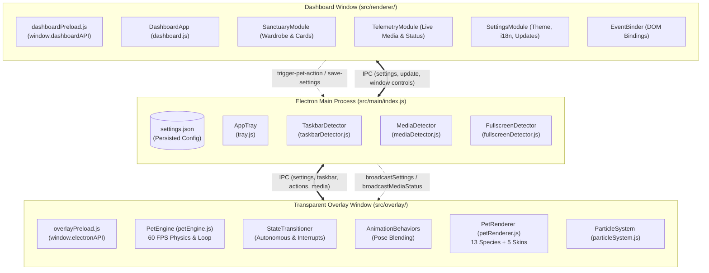

# 🏗️ NavBarPets - Architecture & Codebase Map (ARCHITECTURE.md)

This document provides a comprehensive technical blueprint of **NavBarPets**, detailing the directory hierarchy, multi-process data flow, critical file index, technology stack, and direct-routing guidelines. It is designed to minimize context discovery overhead and enable instant targeted navigation across the codebase for developers and AI agents.

---

## 1. 🗺️ Directory & Module Map

```
NavBarPets/
├── assets/                       # Build assets, packaging icons, and distribution media
├── src/
│   ├── assets/icons/             # Runtime application window and system tray icon binaries
│   ├── main/                     # Electron Main Process & Windows Native Integrations
│   │   ├── checkFullscreen.ps1   # PowerShell/C# User32 P/Invoke script for foreground fullscreen detection
│   │   ├── fullscreenDetector.js # Background polling service for active fullscreen windows and games
│   │   ├── generateIcons.js      # Programmatic fallback icon generator for headless/missing assets
│   │   ├── index.js              # Main Electron process entry point, lifecycle & IPC coordinator
│   │   ├── mediaDetector.js      # Native media player watcher (Spotify, YouTube, VLC, browsers)
│   │   ├── startupManager.js     # Windows registry & login item auto-start manager
│   │   ├── taskbarDetector.js    # Windows taskbar geometry, orientation & height evaluator
│   │   └── tray.js               # Windows Notification Area (System Tray) context menu controller
│   ├── overlay/                  # Transparent Pet Overlay Window & Simulation Engine
│   │   ├── behaviors/            # Procedural kinematics & behavioral action pools
│   │   │   ├── danceBehaviors.js           # Music beat animations and dance choreography pool
│   │   │   ├── idleBehaviors.js            # Ambient idle actions (loaf, yawn, groom, sniff)
│   │   │   ├── locomotionBehaviors.js      # Walking, trotting, sneaking, sprint & zoomies kinematics
│   │   │   ├── playSleepInteractBehaviors.js # Playful flips, peekaboo, sleeping, and 13-species petting love
│   │   │   └── speciesModifiers.js         # Species-specific kinematic multipliers, tail swish & leaf sway
│   │   ├── engine/               # Simulation engine modular subsystems
│   │   │   ├── engineAudioSchedule.js      # Active media status ingestion and sleep schedule watcher
│   │   │   ├── engineInput.js              # Mouse tracking, continuous petting distance & drag physics
│   │   │   └── enginePhysics.js            # Floor baseline, boundary collision, gravity & velocity integration
│   │   ├── particles/            # Visual effects & particle emitter subsystem
│   │   │   ├── particleEmitters.js         # Species-tailored petting VFX, notes, hearts, stars & Zzz spawners
│   │   │   └── particleRenderers.js        # Canvas drawing routines for particle types and shockwaves
│   │   ├── renderers/            # Procedural 2D Canvas Pet Species Renderers (13 Species × 5 Skins)
│   │   │   ├── bullRenderer.js             # Chibi Bull Mascot canvas renderer (Classic, Mythic, Pixel, Sakura, Evori)
│   │   │   ├── bunnyRenderer.js            # Mochi Bunny canvas renderer (Classic, Mythic, Pixel, Sakura, Evori)
│   │   │   ├── cyberleekRenderer.js        # Sentient Cyber Leek canvas renderer (Classic, Mythic, Pixel, Sakura, Evori)
│   │   │   ├── dragonRenderer.js           # Mini Dragon canvas renderer (Classic, Mythic, Pixel, Sakura, Evori)
│   │   │   ├── duckRenderer.js             # Pixel Duck canvas renderer (Classic, Mythic, Pixel, Sakura, Evori)
│   │   │   ├── foxRenderer.js              # Kitsune Fox canvas renderer (Classic, Mythic, Pixel, Sakura, Evori)
│   │   │   ├── jettRenderer.js             # Valorant Jett canvas renderer (Classic, Mythic, Pixel, Sakura, Evori)
│   │   │   ├── marioRenderer.js            # Super Mario canvas renderer (Classic, Mythic, Pixel, Sakura, Evori)
│   │   │   ├── nekoRenderer.js             # Neko Cat canvas renderer (Classic, Mythic, Pixel, Sakura, Evori)
│   │   │   ├── penguinRenderer.js          # Chilly Penguin canvas renderer (Classic, Mythic, Pixel, Sakura, Evori)
│   │   │   ├── pikachuRenderer.js          # Pikachu canvas renderer (Classic, Mythic, Pixel, Sakura, Evori)
│   │   │   ├── sharedHelpers.js            # Shared shadows, pixel helpers, dreamwings, stars & accessories
│   │   │   ├── shibaRenderer.js            # Shiba Inu canvas renderer (Classic, Mythic, Pixel, Sakura, Evori)
│   │   │   └── slimeRenderer.js            # Cyber Slime canvas renderer (Classic, Mythic, Pixel, Sakura, Evori)
│   │   ├── states/               # State machine decision handlers
│   │   │   ├── stateAutonomous.js          # Autonomous behavior selection based on energy/weights
│   │   │   └── stateInterrupts.js          # High-priority state interrupts (petting, dragging, dance)
│   │   ├── animationBehaviors.js # Master procedural kinematics & pose calculation coordinator
│   │   ├── audioReactive.js      # Web Audio API FFT frequency analyzer for microphone beat sync
│   │   ├── overlay.css           # Fullscreen transparent canvas reset and baseline styling
│   │   ├── overlay.html          # Transparent overlay DOM host and script dependency loader
│   │   ├── particleSystem.js     # Master particle lifecycle manager and 60 FPS update loop
│   │   ├── petEngine.js          # Master 60 FPS simulation loop, physics & skeletal pose blending
│   │   ├── petRenderer.js        # Master 2D Canvas dispatcher routing to species renderers
│   │   └── stateTransitioner.js  # Master Finite State Machine (FSM) managing sequences & transitions
│   ├── preload/                  # Secure Context Bridges (Preload Layer)
│   │   ├── dashboardPreload.js   # Exposes `window.dashboardAPI` with isolated IPC channels
│   │   └── overlayPreload.js     # Exposes `window.electronAPI` with millisecond-0 sync bootstrap
│   └── renderer/                 # Configuration Dashboard Window (Renderer Process)
│       ├── modules/              # Modular dashboard view controllers
│       │   ├── eventBinder.js              # DOM event listeners for navigation, toggles & sliders
│       │   ├── sanctuaryModule.js          # Pet selection gallery, 5-skin chips & turntable wardrobe modal
│       │   ├── settingsModule.js           # Theme switching, language updates, toasts & GitHub release checks
│       │   └── telemetryModule.js          # Real-time Now Playing media display & taskbar warning banner
│       ├── styles/               # Component-scoped CSS architecture
│       │   ├── components.css              # Buttons, toggles, range sliders, cards & badge tokens
│       │   ├── layout.css                  # Custom title bar, sidebar navigation & main content grid
│       │   ├── sanctuary.css               # Pet card gallery, responsive grid, 5-skin tags & wardrobe modal
│       │   ├── tabs.css                    # Tab containers, setting sections & telemetry cards
│       │   ├── themes.css                  # Color schemes (Midnight, Cyberpunk, Pastel, etc.)
│       │   └── variables.css               # Design tokens, color palette, shadows & typography
│       ├── dashboard.js          # Dashboard master controller and preview canvas render loops
│       ├── i18n.js               # Turkish & English localization dictionary and pet profile metadata
│       ├── index.css             # Main stylesheet entry point importing design tokens
│       └── index.html            # Dashboard window markup and UI structure
├── electron-builder.json         # NSIS installer and portable executable packaging configuration
└── package.json                  # Project manifest, dev dependencies & build scripts
```

---

## 2. 🔄 Data Flow & Multi-Process Architecture

NavBarPets operates on a decoupled multi-process architecture consisting of three primary layers:



### Core Architecture & Communication Principles

1. **Millisecond-0 Synchronous Bootstrap:**
   - When the overlay window initializes, `overlayPreload.js` performs `ipcRenderer.sendSync('get-initial-overlay-data')`. This ensures that configuration, display geometry, and taskbar baseline offsets are available at millisecond 0, preventing layout popping or visual flicker.
2. **Transparent Click-Through Overlay:**
   - The overlay window is configured with `transparent: true`, `frame: false`, `alwaysOnTop: 'screen-saver'`, `focusable: false`, and `setIgnoreMouseEvents(true, { forward: true })`.
   - When the user hovers over the pet canvas bounding box, `setInteractiveRegion(true)` is dispatched to enable direct petting, dragging, and dropping.
3. **Zero-Resource Fullscreen Suspension:**
   - `FullscreenDetector` uses Windows User32 APIs via PowerShell to detect active foreground games or fullscreen windows. When detected, the overlay is hidden and the `requestAnimationFrame` render loop is completely frozen (0% CPU/GPU overhead).
4. **Procedural Skeletal Pose Blending & 5-Skin System:**
   - Animations avoid static sprite sheets. Every companion supports 5 procedural skins with distinct color palettes and tailored morphological features:
     - **✦ Mythic (`cool`):** High-definition neon cyber effects, luminous auras, data circuit veins, and dynamic ambient lighting.
     - **★ Classic (`classic`):** Cozy nostalgic vector charm, organic white-to-green/warm tones, and clean minimalist palette (default skin).
     - **👾 Pixel Art (`pixel`):** Authentic 8-bit/16-bit stepped pixel geometry, square eyes/pupils, blocky tails/wings, and retro arcade aesthetic.
     - **🌸 Sakura (`sakura`):** Japanese spring aesthetic, blooming 5-petal cherry blossom flowers, drifting petals, kimono/shrine ornaments, and serene pastel palettes.
     - **✨ Evori Dreamwings (`evori`):** Translucent glowing butterfly/fairy wings, floating star halos, orbiting astral constellation crystals, and starlight lavender & gold tones.
5. **High-Performance Dashboard Culling Architecture:**
   - `SanctuaryModule` utilizes an `IntersectionObserver` to track card visibility inside the scroll container.
   - Off-screen cards are completely skipped from canvas rendering.
   - When the user navigates away from the Pet Sanctuary tab, all preview loops are suspended (0% CPU/GPU overhead).
   - Gallery cards are paced at 30 FPS with cached 2D contexts, while the active Wardrobe modal turntable runs at 60 FPS.
6. **Petting Interaction & Kinematic Love Reactions:**
   - Brushing the cursor over the companion triggers continuous petting detection (`engineInput.js`), activating the `petting_love` state interrupt.
   - Companions enter joyful poses (squinted happy eyes, head tilts, body squish, leaf/tail flutter) and spawn multi-layered species-specific heart and shockwave VFX (`particleEmitters.js`).

---

## 3. 📌 Critical Files Index

| File Path | Core Responsibility | Common Modification Triggers |
| :--- | :--- | :--- |
| `src/main/index.js` | Main process lifecycle, window orchestration, IPC handlers, configuration disk persistence. | Adding new IPC channels, updating window flags, or modifying persistence schema. |
| `src/overlay/petEngine.js` | 60 FPS game loop, kinematic updates, gravity, drag physics, floor alignment. | Adjusting gravity/velocity, z-indexing, or floor baseline math. |
| `src/overlay/petRenderer.js` | Master 2D Canvas dispatcher; handles scaling, direction, squash & stretch, accessories. | Registering a new pet species or adding universal accessories (hats, aura). |
| `src/overlay/renderers/*.js` | Species-specific 2D Canvas drawing algorithms and 5-Skin (Mythic, Classic, Pixel Art, Sakura, Evori) rendering. | Redesigning pet visuals, color palettes, or skin morphology. |
| `src/overlay/renderers/cyberleekRenderer.js` | Sentient Cyber Leek renderer with 5 morphological skins & sprout flutter. | Modifying Cyberleek stalks, leaves, plasma blades, or visor details. |
| `src/overlay/renderers/bullRenderer.js` | Chibi Bull Mascot renderer with 5 morphological skins, curved horns & septum ring. | Modifying Bull horns, hooves, armor plates, or tail tuft physics. |
| `src/overlay/particles/particleEmitters.js` | Species-specific petting reaction VFX, hearts, notes, stars, and Zzz particles. | Adding custom particle palettes, shockwave colors, or burst triggers. |
| `src/overlay/animationBehaviors.js` | Procedural kinematic calculation pools (idle, walk, run, dance, play, sleep). | Defining new dance routines, idle quirks, or movement kinematics. |
| `src/overlay/stateTransitioner.js` | Finite State Machine (FSM), state duration timers, animation sequences, interrupts. | Tuning autonomous behavior probabilities or petting/drag transitions. |
| `src/renderer/dashboard.js` | Dashboard master controller, settings synchronization, preview canvas render loops. | Dashboard initialization logic or global state coordination. |
| `src/renderer/i18n.js` | Turkish & English translation dictionary, pet lore, and localized metadata. | Adding UI text, expanding localized languages, or updating pet descriptions. |
| `src/renderer/modules/sanctuaryModule.js` | Pet card gallery, 5-skin chip selection, intersection observer culling, and turntable modal. | Updating pet card layouts, aura effects, or turntable showcase logic. |
| `src/main/mediaDetector.js` | Native PowerShell query engine for Spotify, YouTube, Chrome, Edge, VLC media tracking. | Adding support for new media players or improving track title parsing. |

---

## 4. 🛠️ Dependencies & Tech Stack

- **Runtime Environment:** Node.js 22.x, Electron `34.0.0`
- **Application Packager:** `electron-builder` `25.1.8` (NSIS installer & portable distribution)
- **Rendering Engine:** Hardware-accelerated HTML5 Canvas 2D Context (60 FPS procedural rendering)
- **Audio & Beat Engine:** Web Audio API (`AudioContext`, `AnalyserNode` FFT analysis)
- **OS Entegrations:**
  - Windows API (PowerShell C# P/Invoke `User32.dll` for fullscreen and taskbar detection)
  - Electron `app.setLoginItemSettings` (Windows startup auto-launch)
- **Design Philosophy:** Zero runtime npm dependencies (`dependencies: {}`); built purely with vanilla JavaScript, modern CSS, and native Electron APIs for lightweight performance and instant startup.

---

## 5. 🧭 Modular Direct-Routing & Development Guidelines

When implementing changes or debugging issues, use this routing table to directly navigate to the exact files without full-repo searches:

### Direct Action Routing Table

| Goal / Feature Area | Target Files to Open |
| :--- | :--- |
| **Adding a New Pet Species** | 1. `src/overlay/renderers/[newSpecies]Renderer.js` *(Create new renderer)*<br>2. `src/overlay/petRenderer.js` *(Add switch case & module resolve)*<br>3. `src/overlay/overlay.html` & `src/renderer/index.html` *(Add `<script>` tags)*<br>4. `src/renderer/dashboard.js` *(Add species ID to `PET_IDS`)*<br>5. `src/renderer/i18n.js` *(Add TR/EN metadata to `petData`)*<br>6. `src/overlay/behaviors/speciesModifiers.js` *(Add anatomy kinematics)*<br>7. `src/overlay/behaviors/playSleepInteractBehaviors.js` & `particleEmitters.js` *(Add petting love animation & VFX)*<br>8. `src/main/tray.js` *(Add species option to context menu)* |
| **Adding a New Animation / Dance** | 1. `src/overlay/behaviors/[category]Behaviors.js`<br>2. `src/overlay/animationBehaviors.js` *(Register in `this.pools`)* |
| **Modifying Pet Visuals or Skins** | `src/overlay/renderers/[species]Renderer.js` & `src/overlay/renderers/sharedHelpers.js` |
| **Customizing Petting Animations & VFX** | `src/overlay/behaviors/playSleepInteractBehaviors.js` & `src/overlay/particles/particleEmitters.js` |
| **Optimizing Dashboard Render Loops** | `src/renderer/modules/sanctuaryModule.js` (`startPreviewRenderLoop`, `IntersectionObserver`) |
| **Adjusting Physics, Floor & Drag** | `src/overlay/engine/enginePhysics.js` & `src/overlay/engine/engineInput.js` |
| **Adding New Particles or VFX** | `src/overlay/particles/particleEmitters.js` & `src/overlay/particles/particleRenderers.js` |
| **Adding a New IPC Channel** | 1. `src/main/index.js` *(`setupIPCHandlers`)*<br>2. `src/preload/dashboardPreload.js` or `overlayPreload.js`<br>3. `src/renderer/modules/eventBinder.js` or consumer module |
| **Modifying Dashboard UI & Themes** | `src/renderer/index.html` & `src/renderer/styles/*.css` |
| **Media Player Detection Rules** | `src/main/mediaDetector.js` |
| **Taskbar & Fullscreen Detection** | `src/main/taskbarDetector.js` & `src/main/fullscreenDetector.js` |

---

### Core Coding & Integration Principles

1. **Universal Module Compatibility:**
   - Overlay and renderer modules must use the `resolve*Module` pattern to seamlessly support browser/DOM execution (`window` / `globalThis`) as well as Node.js test execution (`require` / `module.exports`).
2. **Garbage Collection Optimization:**
   - In 60 FPS loops (`petEngine.js`, `petRenderer.js`, `particleSystem.js`), avoid recurring heap allocations (`new Object()`, `new Array()`) within frame cycles.
3. **Click-Through Boundary Discipline:**
   - The overlay must default to `setIgnoreMouseEvents(true, { forward: true })`. Only enable pointer interaction when the cursor intersects the pet's active bounding box.
4. **Bilingual Localization (i18n):**
   - Every user-facing string, notification toast, and pet profile must be mirrored in both Turkish (`tr`) and English (`en`) inside `src/renderer/i18n.js`.
5. **Auto-Update Architecture Rule:**
   - Whenever you add, rename, remove, or significantly refactor files/modules/skins/pets, update `ARCHITECTURE.md` to keep the project map completely synchronized.
