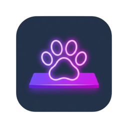

# 🐾 NavBarPets - Windows Desktop Companions

<div align="center">



### Windows Görev Çubuğunuzda Yaşayan Sevimli ve Akıllı Masaüstü Yol Arkadaşları

[🇹🇷 **Türkçe**](README.md) • [🇺🇸 **English**](README_EN.md)

<br/>

[](https://github.com/phaticusthiccy/NavBarPets/releases/latest)
<br/>

[](https://electronjs.org/)
[](https://nodejs.org/)
[](https://microsoft.com/windows)
[](LICENSE)

</div>

---

## 📥 İndir ve Kur

NavBarPets'i hemen bilgisayarınızda çalıştırmak için aşağıdaki bağlantılardan en son sürümü indirebilirsiniz:

| Paket Türü | İndirme Bağlantısı | Açıklama |
| :--- | :--- | :--- |
| **🚀 Windows Kurulum (.exe)** | [**NavBarPets Setup İndir**](https://github.com/phaticusthiccy/NavBarPets/releases/latest) | Otomatik güncellenebilir, masaüstü kısayolu oluşturan standart Windows kurulum paketi. |
| **📦 Taşınabilir Sürüm (Portable .exe)** | [**NavBarPets Portable İndir**](https://github.com/phaticusthiccy/NavBarPets/releases/latest) | Kurulum gerektirmez; USB bellekten veya istediğiniz klasörden doğrudan çalışır. |

> [!TIP]
> En son yayınlanan tüm sürümlere, güncelleme notlarına ve kaynak kodlarına [GitHub Releases](https://github.com/phaticusthiccy/NavBarPets/releases) sayfasından ulaşabilirsiniz.

---

## 📖 Genel Bakış

**NavBarPets**, Windows Görev Çubuğunuzun (Taskbar) üzerinde özgürce gezen, bilgisayarınızda çalan şarkılara kulaklık takıp dans eden, gerçek zamanlı biyolojik uyku takvimine sahip, çift skin (Efsanevi & Klasik) desteği sunan ve 75'ten fazla akıcı prosedürel animasyon barındıran modern bir masaüstü arkadaşı uygulamasıdır.

Transparan pencere motoru ve donanım hızlandırmalı HTML5 Canvas çizim sistemi sayesinde sistem kaynaklarını yormadan (düşük CPU & RAM) arka planda sessizce çalışır.

---

## ✨ Temel Özellikler

### 🐾 1. 11 Benzersiz Pet & Efsanevi Karakter
Her biri kendine has animasyonlara, parçacık efektlerine ve ses/dans tepkilerine sahip 11 farklı yol arkadaşı:

- **🐱 Neko Kedi (`neko`):** Çift ruhani kuyruk, kulak seğirmesi, pati temizleme, ekmek somunu (loaf) pozisyonu, disko dansı.
- **🐕 Shiba Inu (`shiba`):** Kıvrık kuyruk sallama, yeri koklama, blep dili çıkarma, zoomies koşusu ve sevinç zıplamaları.
- **🟢 Cyber Slime (`slime`):** Holografik parıldama, neon çekirdek, jöle yaylanması ve elektrik parçacıkları.
- **🐉 Mini Dragon (`dragon`):** Duman halkaları çıkarma, kanat çırparak süzülme, kuyruğuna sarılma.
- **🦆 Pixel Duck (`duck`):** Paytak paytak yürüme, suya dalma hareketi, 360 derece dönerek dans etme.
- **🦊 Kitsune Fox (`fox`):** Büyülü alev uçlu kabarık tilki kuyruğu, kor parçacıkları ve çevik 4 ayaklı koşu kinematiği.
- **🐰 Mochi Bunny (`bunny`):** Sallanan uzun kulaklar, seğiren burun, havuç sevgisi ve neşeli zıp zıplar.
- **🐧 Kutup Pengueni (`penguin`):** Kırmızı örgü kış atkısı, kanat çırpma ve sevimli paytak adımlar.
- **💨 Valorant Jett (`jett`):** Anime yüz hatları, parlak turkuaz gözler, rüzgar aurası, havada süzülen Kunai bıçakları ve fırtına deparları.
- **🍄 Super Mario (`mario`):** İkonik kırmızı 'M' şapkası, tulumu, sevimli bıyığı ve süper zıplayışları.
- **⚡ Pikachu (`pikachu`):** Zikzak şimşek kuyruk, kırmızı elektrik yanak keseleri ve bağımsız kulak hareketleri.

---

### 👗 2. Çift Skin Desteği & Görünüm Vitrini (Wardrobe)
- **✨ Efsanevi (`✦ MYTHIC`):** Neon siber detaylar, dinamik gölgelendirme, parıltılı parçacıklar ve yüksek çözünürlüklü kaplamalar.
- **🌟 Klasik (`★ RETRO`):** Nostaljik sade piksel sanat tarzı, orijinal renk paleti ve minimalist masaüstü estetiği.
- **🔍 Görünüm Vitrini Modalı:** Büyük ölçekli 160x160 döner canlı platform (turntable) üzerinde pet'leri inceleme, `Breathe`, `Walk`, `Dance` ve `Sleep` pozlarını canlı test etme ve tek tıkla kuşanma.

---

### 🎬 3. 75+ Zengin Prosedürel Kinematik & Durum Havuzu
Petler sıkıcı döngülere girmeden 6 farklı ana davranış havuzundan ve geçiş matrislerinden rastgele hareketler seçer:
- **Boşta Bekleme:** Kulak temizleme, havayı koklama, tüyleri silkeleme, ayakta uyuklama, esneme, kutuya girme.
- **Yürüme:** Gururlu adımlama, temkinli süzülme, paytak sallanma, 4 bacaklı çapraz adım kinematiği.
- **Koşma & Hızlanma:** Dörtnala zıplama, viraj drifti, zikzak koşusu, turbo sprint.
- **Dans & Müzik:** Robot pop-and-lock, dalga shuffle, coşkulu yüksek zıplama, step/tap dansı, moonwalk.
- **Oyun:** Kendi etrafında takla atma, ce-ee yapma, kelebek yakalama, hedef kilitlenip atılma.
- **Uyku:** Sırt üstü yayılma, horlama baloncukları, rüyada koşma, kuyruğuna sarılarak uyuma.

---

### 🎵 4. Spotify & YouTube Canlı Müzik Algılama
- Bilgisayarınızda (Spotify, YouTube, Medya Oynatıcılar, vb.) çalan şarkıları otomatik algılar.
- Pet hemen **kulaklıklarını takar**, müzik ritmine göre dans figürlerine geçer ve nota parçacıkları yayar.
- Dashboard arayüzünde aktif çalan parça, sanatçı bilgisi ve canlı ekolayzer görselleştiricisi gösterilir.

---

### ⏰ 5. Biyolojik Uyku & Uyanma Planlayıcı
- Belirlenen saatlerde (Örn: `23:00 - 08:00`) petler otomatik olarak **gece şapkalarını** takar ve tatlı Zzz balonlarıyla derin uykuya dalar.
- İstenildiği an dashboard veya sistem tepsisi üzerinden manuel uyutma/uyandırma yapılabilir.

---

### 📏 6. Görev Çubuğu Zemin, Boyut & Görünürlük Ayarları
- **👁️ Petleri Aç/Kapat Switch'i:** Dashboard başlığından veya Sistem Tepsisinden tek tıkla petleri anında gizleme/gösterme.
- **Pet Boyut Ölçeği:** 0.6x ile 2.0x arasında serbest boyutlandırma.
- **Zemin Hizalama Modu:** Görev çubuğunun üst yüzeyinde yürüme veya en alt tabanında durma.
- **Yükseklik İnce Ayarı:** Özel Windows temaları ve DPI ölçeklemeleri için piksel hassasiyetinde dikey kaydırma.

---

### 🎨 7. 8 Modern Arayüz Teması & Tam Çift Dil Desteği
- **8 Özel Tema:** *Midnight Glass, Cyber Neon, Cozy Pastel, Deep OLED, Sunset Aurora, Emerald Forest, Vampire Velvet, Nordic Frost*.
- **🇹🇷 Türkçe & 🇬🇧 İngilizce:** SVG vektör bayraklı şık dil seçici ile tek tıkla anında çeviri.

---

### 🚀 8. Windows Entegrasyonu & Sistem Tepsisi
- Pencere kapatıldığında arka planda **Sistem Tepsisi (Tray)** alanında çalışmaya devam eder.
- Tepsi menüsünden tek tıkla pet değiştirme, görünürlük kontrolü, uyutma/uyandırma ve müzik dansı testi.
- Windows açılışında otomatik başlatma desteği.

---

## 🛠️ Kaynak Koddan Kurulum ve Geliştirme

### Gereksinimler:
- **Node.js** (v18 veya üzeri önerilir)
- **npm** veya **yarn**
- **Windows 10 / 11**

### 1. Projeyi Klonlayın ve Bağımlılıkları Yükleyin:
```bash
git clone https://github.com/phaticusthiccy/NavBarPets.git
cd NavBarPets
npm install
```

### 2. Geliştirme Modunda Başlatın:
```bash
npm start
```

### 3. Windows Kurulum Dosyası (`.exe`) Oluşturun:
```bash
npm run dist
```
Oluşturulan kurulum (`NavBarPets Setup x.x.x.exe`) ve taşınabilir (`NavBarPets x.x.x.exe`) dosyaları `dist/` klasöründe yer alır.

---

## 📂 Modüler Proje Mimarisi

```
NavBarPets/
├── src/
│   ├── assets/
│   │   └── icons/               # Uygulama ve Sistem Tepsisi ikonları (icon.png)
│   ├── main/
│   │   ├── index.js             # Electron Main Process & Pencere Yöneticisi
│   │   ├── tray.js              # Sistem Tepsisi (Tray) & Dinamik Menü
│   │   ├── mediaDetector.js     # Windows Medya & Müzik Algılama Motoru
│   │   ├── taskbarDetector.js   # Görev Çubuğu Konum & Boyut Algılayıcı
│   │   ├── fullscreenDetector.js# Tam Ekran Oyun & Uygulama Algılayıcı
│   │   └── startupManager.js    # Windows Başlangıç Kayıt Defteri Entegrasyonu
│   ├── overlay/
│   │   ├── overlay.html         # Şeffaf Masaüstü Katmanı
│   │   ├── petEngine.js         # Ana Motor & Evrensel Çözümleyici
│   │   ├── petRenderer.js       # Karakter Çizim Ana Yöneticisi
│   │   ├── animationBehaviors.js# Kinematik Ana Yöneticisi
│   │   ├── particleSystem.js    # Parçacık Ana Yöneticisi
│   │   ├── stateTransitioner.js # Durum Makinesi Ana Yöneticisi
│   │   ├── renderers/           # 11 Ayrı Tür Çizicisi + sharedHelpers.js
│   │   ├── behaviors/           # idle, locomotion, dance, play/sleep & species
│   │   ├── particles/           # particleRenderers.js & particleEmitters.js
│   │   ├── states/              # stateInterrupts.js & stateAutonomous.js
│   │   └── engine/              # physics, input & audioScheduler
│   ├── preload/
│   │   ├── dashboardPreload.js  # Dashboard IPC Güvenli Köprüsü
│   │   └── overlayPreload.js    # Overlay IPC Güvenli Köprüsü
│   └── renderer/
│       ├── index.html           # Dashboard UI & Vitrin Modalı
│       ├── dashboard.js         # Dashboard Ana Yöneticisi
│       ├── i18n.js              # Türkçe & İngilizce Çeviri Sözlüğü
│       ├── modules/             # sanctuary, telemetry, settings, eventBinder
│       └── styles/              # variables, themes, layout, components, sanctuary, tabs
├── electron-builder.json        # NSIS & Portable Dağıtım Yapılandırması
├── package.json
└── README.md
```

---

## 📜 Lisans

Bu proje [MIT Lisansı](LICENSE) kapsamında lisanslanmıştır.
